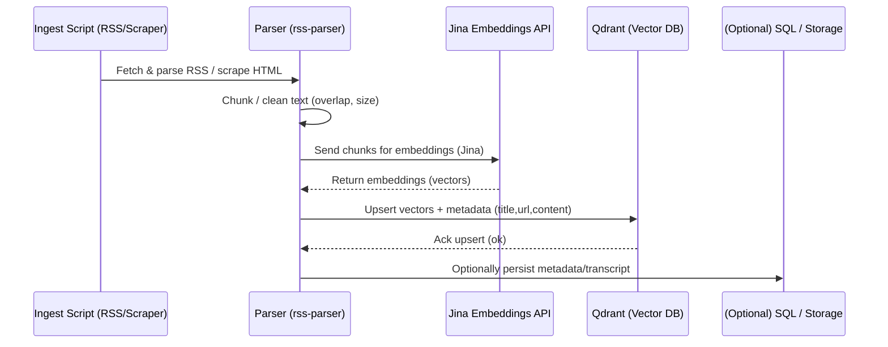
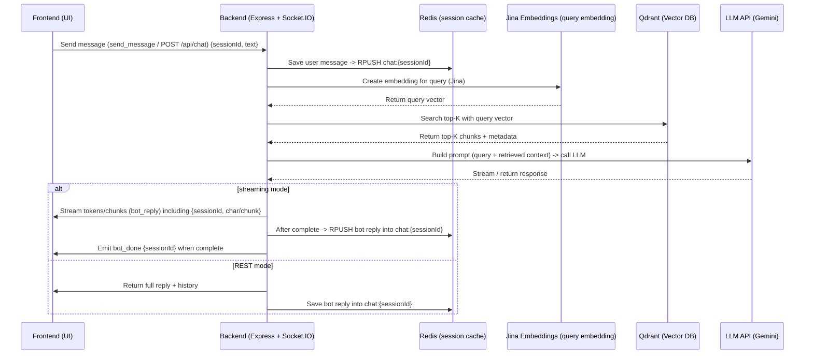

# 🖥️ Backend - RAG Powered News Chatbot

The backend powers the **RAG (Retrieval-Augmented Generation) News Chatbot**, handling:
- Chat sessions and message history
- Creating and indexing embeddings for semantic retrieval
- Redis caching for fast session access
- WebSocket streaming for live responses
- REST APIs for session & history management

---

## 🚀 Tech Stack

- **Node.js + Express** — REST API server  
- **Socket.IO** — Real-time bidirectional communication (streaming replies, typing indicators)  
- **Redis** — stores & caches session history (fast retrieval)  
- **Vector Database** Qdrant — stores embeddings for semantic search.
- **Embeddings** Jina — Converts text into high-dimensional numeric vectors for semantic similarity search.
- **LLM Provider** Google GenAI — final answer generation

---

## 💡 Why This Tech Stack?

Each technology in this stack was chosen to optimize for **real-time performance**, **scalability**, and **developer velocity** while building an RAG-powered chatbot for news verification.

- **Node.js + Express**  
  We needed a lightweight, high-performance backend that can handle both REST APIs and WebSocket connections.  
  Node.js is well-suited for I/O-heavy workloads (like chat apps), while Express keeps the routing and middleware layer simple yet extensible.

- **Socket.IO**  
  Chatbots feel broken if replies don’t stream in real-time. Socket.IO enables **low-latency, bidirectional communication**, powering typing indicators and token-by-token streaming of LLM responses. It integrates seamlessly with Node.js and offers built-in reconnection and reliability.

- **Redis**  
  Session history needs to be retrieved **fast** and also expire automatically. Redis is an in-memory store with millisecond lookups, making it perfect for chat logs.  
  - We store each session as a Redis list (`chat:sessionId`).  
  - We apply TTLs for auto-cleanup of inactive sessions.  
  This ensures the system scales horizontally without worrying about stale data.

- **Vector Database (Qdrant)**  
  Simple keyword search is not enough for fact-checking news. We need **semantic search**.  
  Qdrant is a vector DB optimized for embeddings, with high recall and filtering capabilities. It scales well, supports payload filtering (metadata), and runs easily both locally (Docker) and in production.

- **Embeddings (Jina)**  
  To bridge natural language and numeric search, we use **Jina embeddings**, which transform text into high-dimensional vectors.  
  - These embeddings capture semantic meaning beyond keywords.  
  - Stored in Qdrant, they enable retrieving the most relevant context passages for any user query.  
  We explicitly chose Jina over OpenAI embeddings due to speed, cost, and competitive quality for multilingual/news content.

- **LLM Provider (Google GenAI)**  
  After retrieving context, we need a model to **generate answers**. We use Google GenAI for its strong performance in factual tasks and ability to integrate structured prompts.  
  - REST queries return full answers.  
  - WebSocket queries allow streaming responses token-by-token.  
  This setup ensures the best balance of accuracy, speed, and user experience.


---

## 🛠️ Requirements & Local Setup

**Prereqs**
- Node.js (v20+ recommended)
- Redis (running locally or accessible via `REDIS_URL`)
- Vector DB (Qdrant) credentials (for indexing & retrieval)
- LLM API key (Google Gemini)

**Docker Setup for Qdrant and Redis**

***Redis setup (on windows)***
``` bash 
docker run -d --name redis -p 6379:6379 redis:8.2.1
```
- [Quick Setup Guide](https://redis.io/docs/latest/operate/oss_and_stack/install/install-stack/docker/)

***Qdrant setup (on windows)***
```bash
 docker run -d -p 6333:6333 -p 6334:6334 -v "${windows_storage_directory_path}:/qdrant/storage" qdrant/qdrant
```

- [Quick Setup Guide](https://qdrant.tech/documentation/quickstart/)


**Clone & install**
```bash
git clone https://github.com/your-org/rag-news-chatbot.git
cd rag-news-chatbot/backend
npm install
npm run dev
```
---

## 📊 Ingestion & Indexing (RSS → Jina → Qdrant)
- The system includes a **data ingestion pipeline** that runs during application startup (and can be scheduled periodically for freshness). Its purpose is to keep the knowledge base up to date with the latest news articles.

### 🔄 Steps in the Pipeline

1. **Fetch Data from RSS Feeds**
   - The application reads from a predefined list of `RSS_FEEDS` (news sources, publishers, etc.).
   - Each feed entry (headline, summary, article link, timestamp) is pulled and normalized into a standard structure.

2. **Preprocess & Chunk Articles**
   - Raw article text is cleaned (HTML tags removed, boilerplate stripped).
   - Text is split into **smaller semantic chunks** to improve retrieval granularity. This ensures that the vector DB can return the **most relevant context pieces**, rather than entire long articles.

3. **Generate Embeddings with Jina**
   - Each chunk of text is passed to the **Jina Embeddings API**, which converts natural language into a **high-dimensional numeric vector**.
   - These embeddings capture the **semantic meaning** of the text, enabling similarity search far beyond keyword matching.

4. **Store in Qdrant (Vector Database)**
   - Embeddings, along with metadata, are stored in **Qdrant**.  
   - Each record includes:
     - `id` (unique chunk identifier)
     - `vector` (Jina embedding)
     - `payload` (metadata such as article source, title, timestamp, URL, etc.)
   - Qdrant supports **fast kNN (nearest-neighbor) search**, filtering, and scaling.

5. **Ready for Query Retrieval**
   - At query time, the user’s question is embedded with Jina and compared against the stored vectors in Qdrant.
   - Top-K most semantically relevant chunks are retrieved and supplied to the LLM as **context**.

---


---

## 🔄 End-to-End Flow

Here’s how a user query flows through the backend:

### Step 1. User Sends Message
- Frontend emits `send_message` (WebSocket) **or** calls `/api/chat` (REST).
- The message is tagged with a `sessionId`.

---

### Step 2. Save User Message
- Backend saves the message to **Redis** (`chat:sessionId`).
- Redis ensures fast retrieval and assigns **TTL** for session expiration.

---

### Step 3. Embeddings + Retrieval
- The user’s query is converted into an **embedding** using Jina embeddings.
- The embedding is compared against **pre-indexed embeddings** in the vector DB (Qdrant).
- **Top-K** most relevant chunks are retrieved along with metadata.

---

### Step 4. Construct LLM Prompt
- Backend builds a structured prompt including:
  - User’s query
  - Retrieved context from vector DB
- This forms the **retrieval-augmented prompt**.

---

### Step 5. Generate Response
- Backend sends the prompt to the **LLM API**.
- The LLM streams or generates a full response.

---

### Step 6. Stream Response to Frontend
- Using **Socket.IO**, the response is streamed **token-by-token** (`bot_reply`).
- On REST calls, the **entire response** is sent once finished.

---

### Step 7. Save Bot Reply
- The final reply is stored in **Redis** under the same `sessionId`.
---

## 📊 Backend Flow (Diagram)



---

## ⚡ Suggested Improvements
- Optimized Ingestion Pipeline – Split text into smaller semantic chunks for faster and more accurate retrieval.
- Streaming Responses from LLM – Stream responses directly from Gemini via WebSockets to reduce latency.
- Rate Limiting – Use rate-limit to prevent endpoint abuse and control API costs.
- Input Sanitization – Sanitize all incoming requests to prevent injection attacks targeting Redis or Qdrant.